# PhotoGallery — Flow Diagrams

Complete sequence diagrams for all major use cases.

---

## 1. Admin Authentication & Sign-In

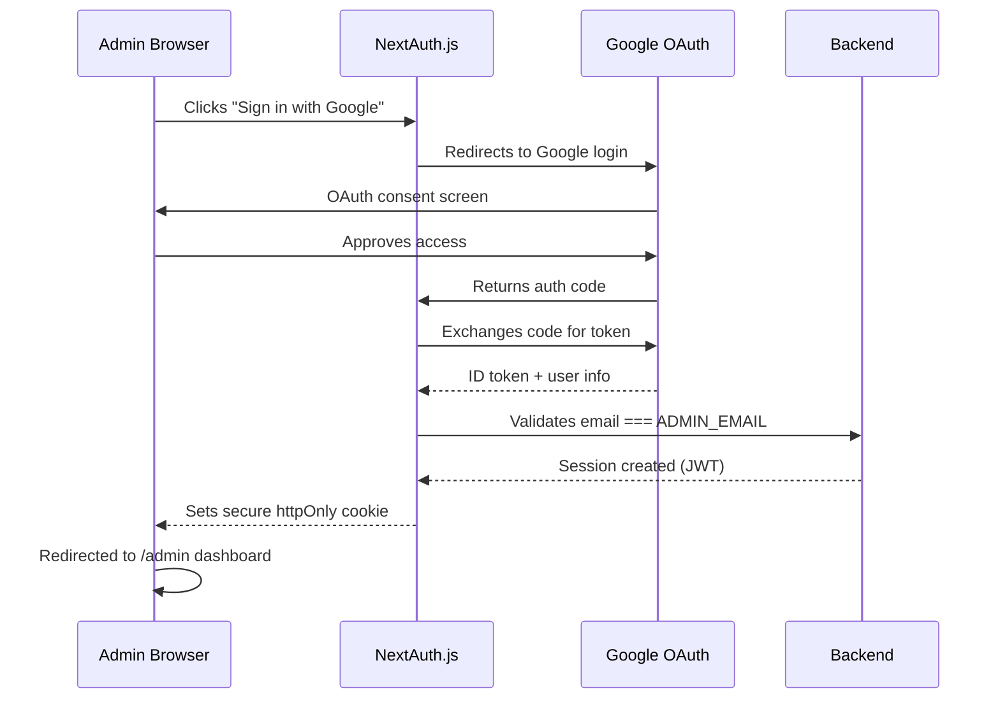

---

## 2. Admin Photo Upload (Complete Flow)

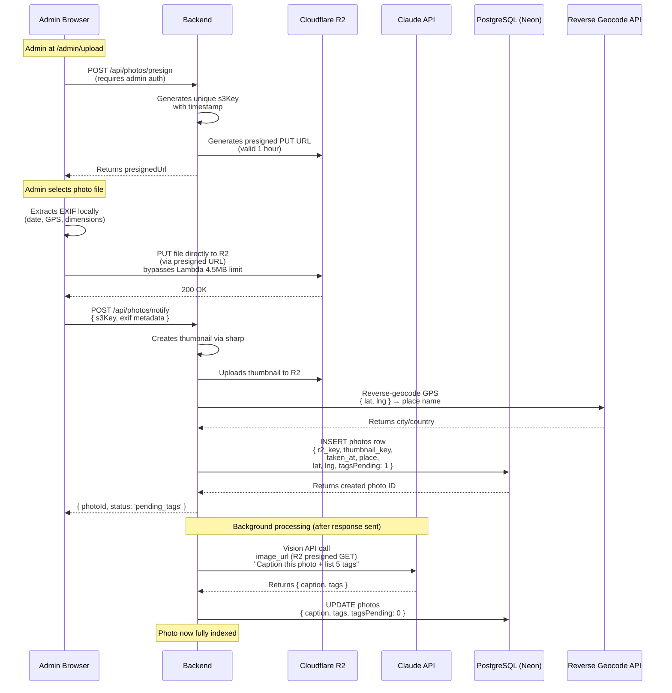

---

## 3. User Browsing Public Gallery

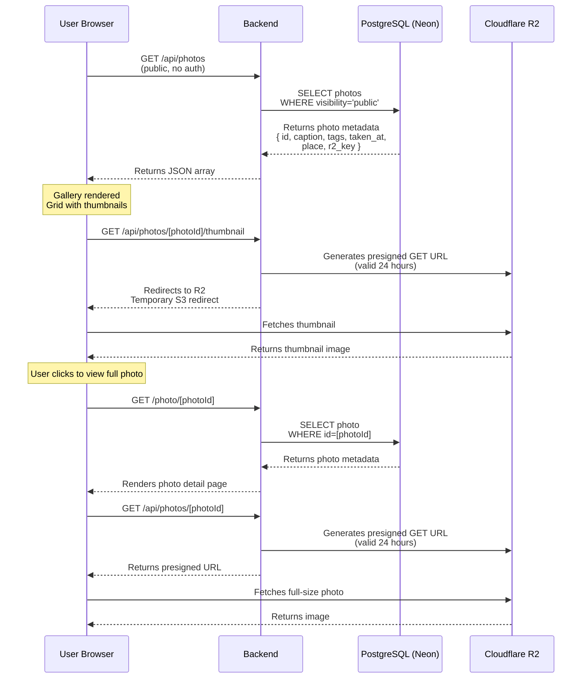

---

## 4. User Views Restricted Photo (Locked)

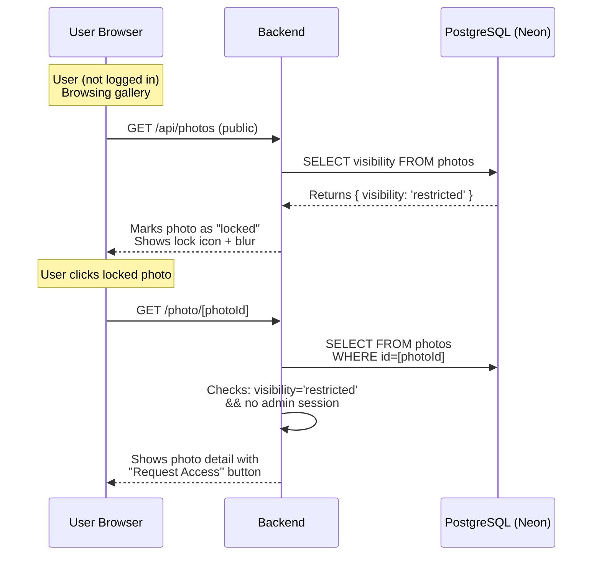

---

## 5. Visitor Requests Photo Access

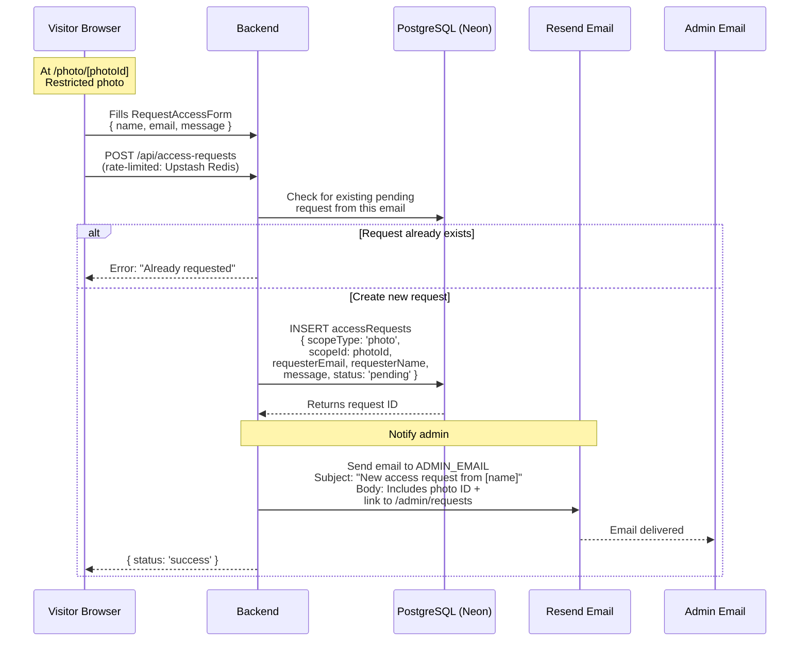

---

## 6. Admin Reviews & Approves Access Requests

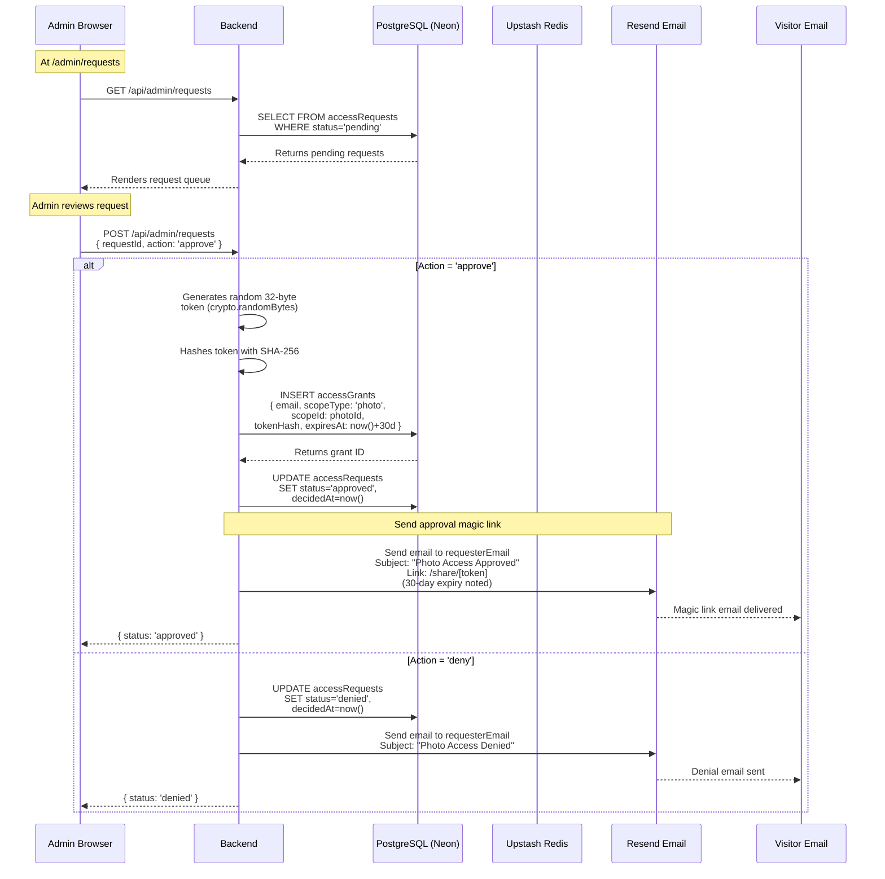

---

## 7. Visitor Uses Magic Link

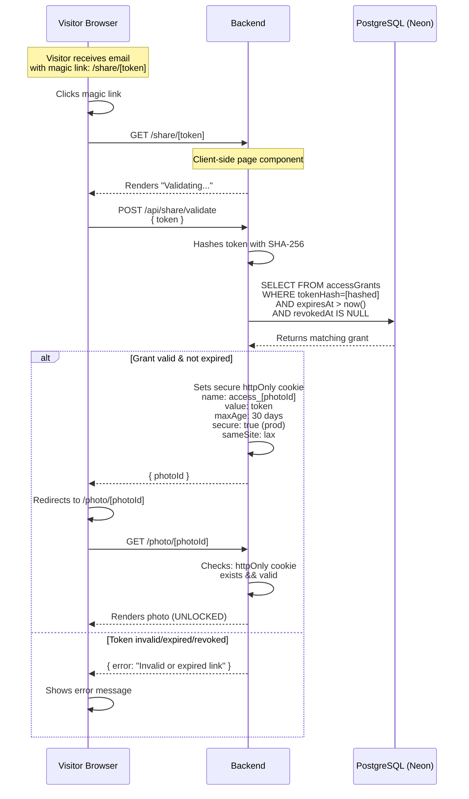

---

## 8. Visitor Views Restricted Photo (With Active Grant)

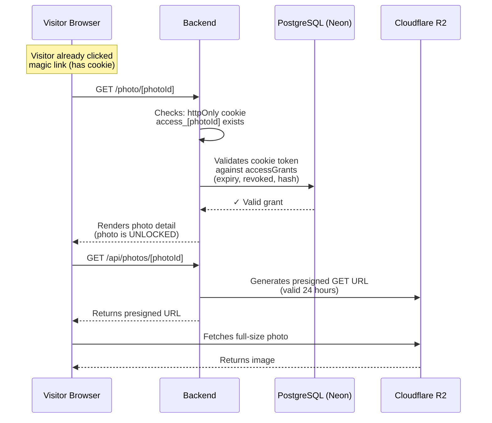

---

## 9. Admin Revokes Photo Access

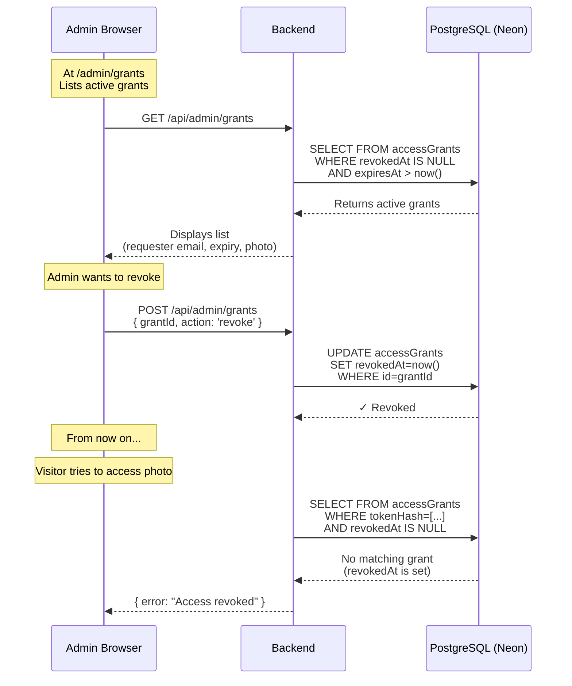

---

## 10. Photo Visibility Toggle (Admin Edit)

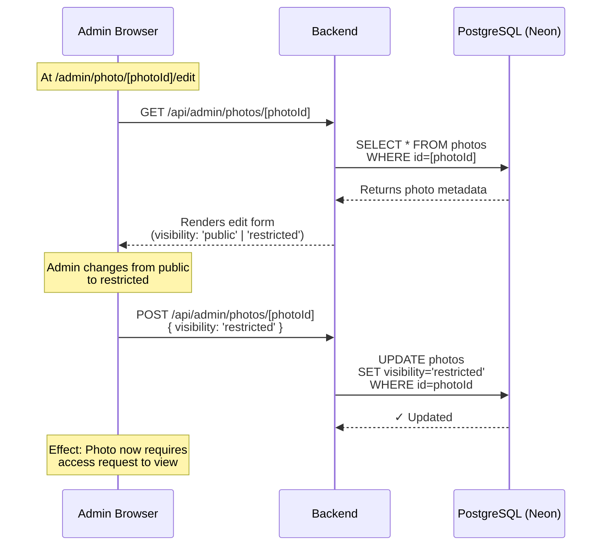

---

## 11. Admin Edits Photo Metadata

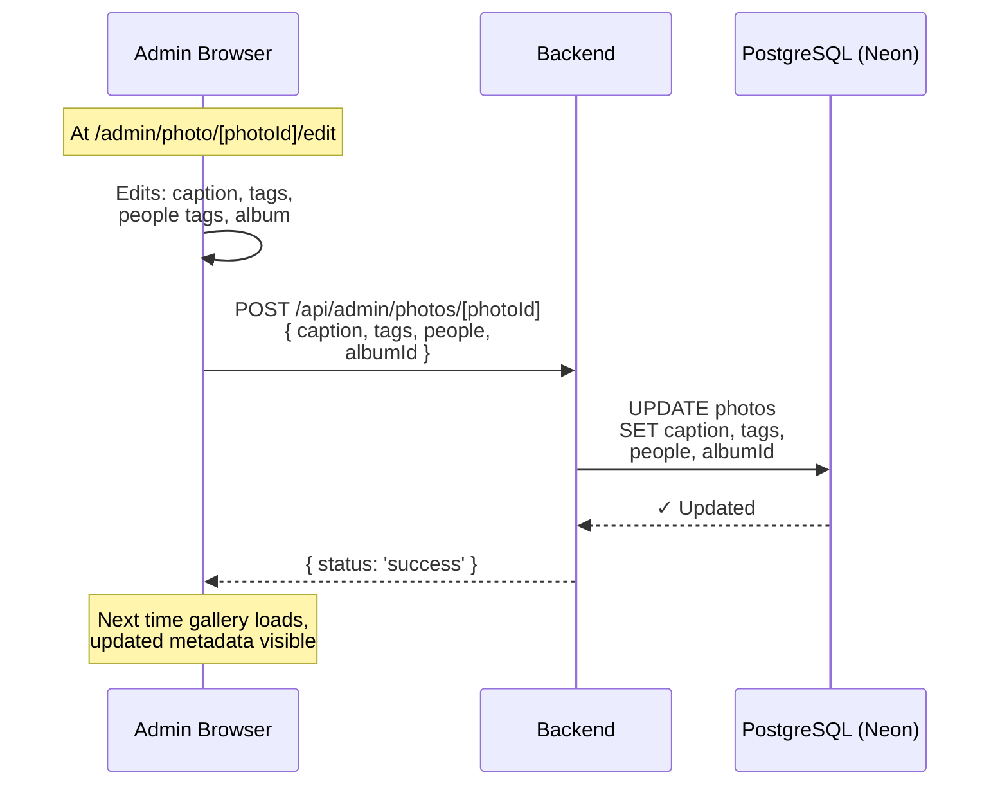

---

## 12. Gallery Filter by Year, Place, Tags

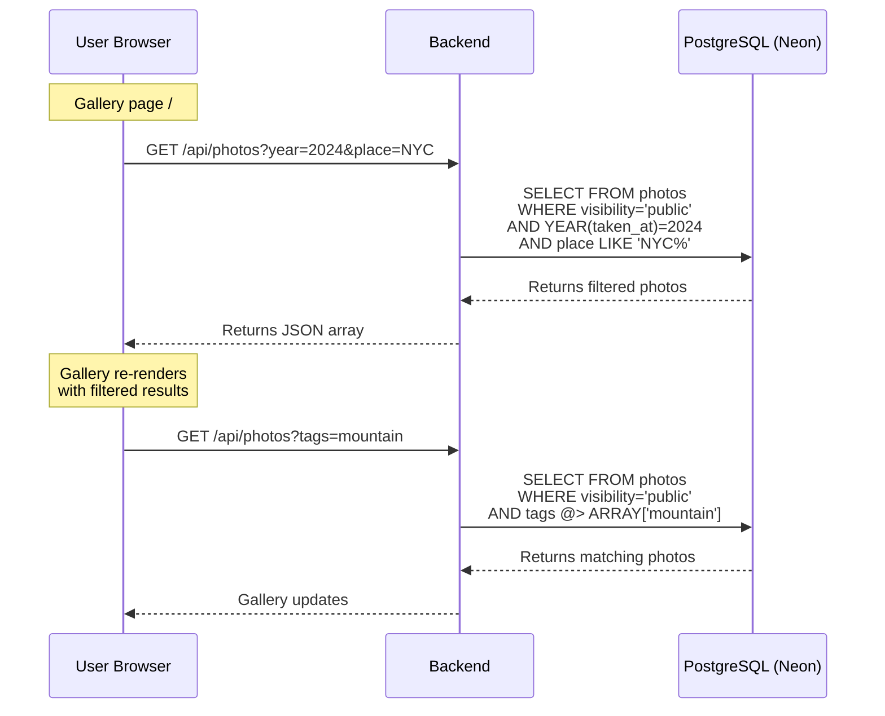

---

## Use Cases Summary

| # | Flow | Participants | Key Features |
|---|------|--------------|--------------|
| 1 | Admin Sign In | Admin, Google OAuth | JWT session, email validation |
| 2 | Photo Upload | Admin, R2, Claude, DB | Direct R2 upload, background tagging |
| 3 | Browse Public | User, DB, R2 | Thumbnails, metadata, filters |
| 4 | View Restricted (Locked) | User, DB | Lock icon, request form shown |
| 5 | Request Access | Visitor, DB, Resend | Dedup check, admin email notify |
| 6 | Admin Approve/Deny | Admin, DB, Resend | Token generation, magic link email |
| 7 | Magic Link Validation | Visitor, DB | Token hash, cookie set |
| 8 | View Restricted (Granted) | Visitor, DB, R2 | Cookie validates grant |
| 9 | Revoke Access | Admin, DB | Mark grant revoked |
| 10 | Toggle Visibility | Admin, DB | Public ↔ Restricted |
| 11 | Edit Metadata | Admin, DB | Manual tags, people, album |
| 12 | Filter Gallery | User, DB | By year, place, tags |

---

## Data Security & Access Patterns

### Public Flow (No Auth Required)
- `GET /api/photos` — public photos only
- `GET /photo/[id]` — public photos only; restricted shows request form
- `GET /api/photos/[id]/thumbnail` — redirects to presigned URL

### Restricted + Grant Flow (Cookie-Based)
- Visitor clicks magic link → token validated → httpOnly cookie set
- Cookie checked on every restricted photo view
- Cookie valid for 30 days or until revoked
- Token never exposed in client-side code (httpOnly prevents XSS leakage)

### Admin Flow (Session-Based)
- NextAuth JWT session + middleware email check
- Protected routes: `/admin/*`, `/api/admin/*`
- Every admin action logged implicitly (timestamps in DB)

### Rate Limiting (Upstash Redis)
- `/api/access-requests` — 10 requests per hour per IP
- `/api/photos/presign` — 5 requests per hour per admin (prevent accidental bill shock)
- `/api/photos/notify` — tied to presign (part of upload flow)

---

## Error Scenarios

| Scenario | Handling |
|----------|----------|
| Photo upload > 4.5MB | Bypassed via presigned URL → direct R2 upload |
| Claude API timeout | Queued via `after()` → retryable in logs |
| Magic link expired | User sees error, can request again |
| Token revoked mid-session | Next photo view fails (cookie still valid, but grant revoked in DB) |
| Spam access requests | Rate limited by Upstash (10/hour/IP) |
| Admin not verified email | Middleware blocks `/admin` access |

